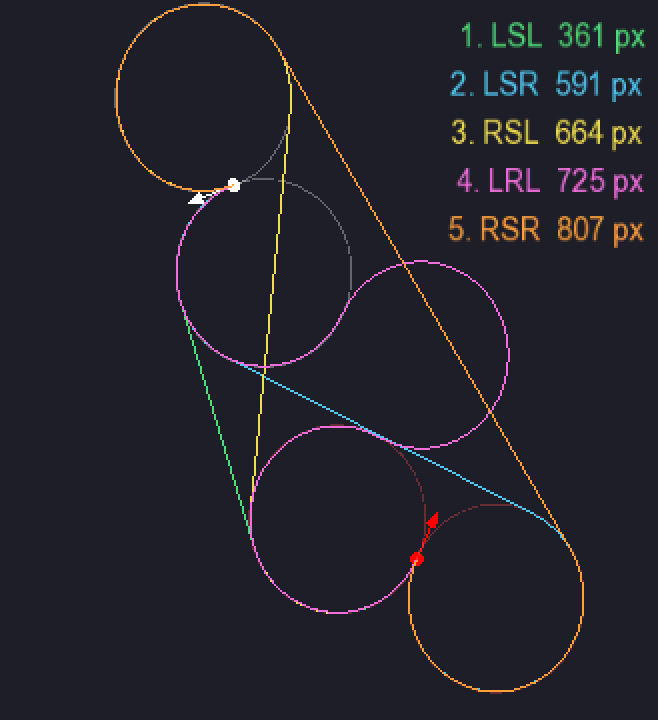

## Visualization of dubins path 



## Running
### Requirements

This project requires [SFML](https://www.sfml-dev.org/) (Simple and Fast Multimedia Library) installed.

On Ubuntu, you can install SFML with:
```bash
sudo apt-get install libsfml-dev
```

On macOS (with Homebrew):
```bash
brew install sfml
```

### Build & Run
```bash
g++ -std=c++17 -o dubins main.cpp dublin.cpp dubins_paths.cpp -lsfml-graphics -lsfml-window -lsfml-system -lm
./dubins
```

### Usage

| Action                 | Effect                                                         |
|------------------------|----------------------------------------------------------------|
| **Left Click**         | Set/drag the **start** point (drag to set orientation)         |
| **Right Click**        | Set/drag the **end** point (drag to set orientation)           |
| **1-6**                | Select and display a particular Dubins path by rank (1 = shortest) |
| **\` (backtick)**      | Toggle display of all path types                               |
| **Mouse Wheel**        | Adjust turning radius                                          |